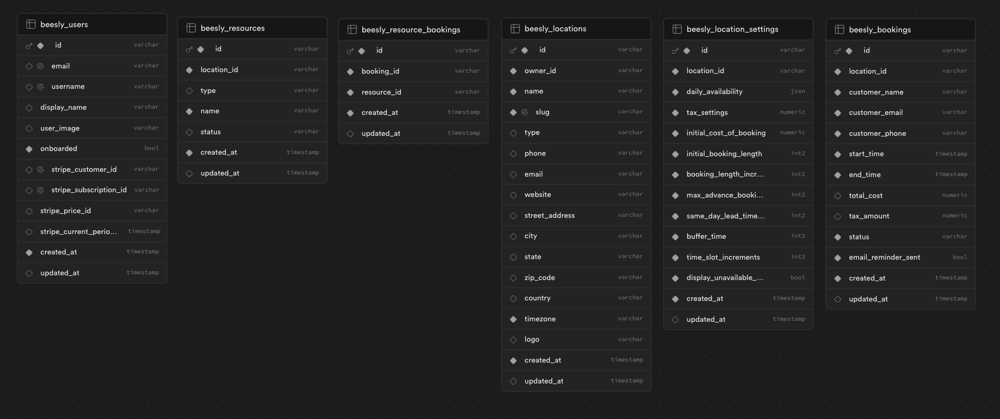

# Beesly

Beesly is a booking system designed for VR lounges, built with Next.js 14 and the T3 stack. It provides a seamless experience for customers to make reservations and for staff to manage bookings and lounge settings.

## Features

- **Booking Portal:** Allows customers to book VR sessions with ease, even for multiple stations and group experiences.
- **Dashboard:** Provides staff with a comprehensive view of daily bookings, enabling them to manage bookings, including adding, editing, and canceling, with ease.
- **Settings Management:** Staff can adjust lounge settings, such as business name, hours of operation, booking conditions, and cleaning buffer times.
- **Automated Communication:** Sends email notifications for booking confirmations, reminders, and updates to customers.

## Tech Stack

- **Frontend:** [Next.js](https://nextjs.org), [Tailwind CSS](https://tailwindcss.com), [Shadcn-ui](https://github.com/shadcn/ui)
- **Backend:** [tRPC](https://trpc.io), [DrizzleORM](https://drizzle-orm.github.io), [PostgreSQL](https://www.postgresql.org), [Sendgrid](https://sendgrid.com)
- **Authentication:** [Clerk](https://)
- **Testing:** [Playwright](https://playwright.dev), [Vitest](https://vitest.dev)
- **Deployment:** [Vercel](https://vercel.com), [Supabase](https://supabase.com)

## Conclusion

Beesly revolutionizes the booking process for VR lounges by providing a tailored solution that addresses their industries unique challenges. With its user-friendly interface and robust backend, Beesly enhances the booking experience for customers and streamlines operational management for lounge owners.

## Schema

_More detailed schema info coming soon._
